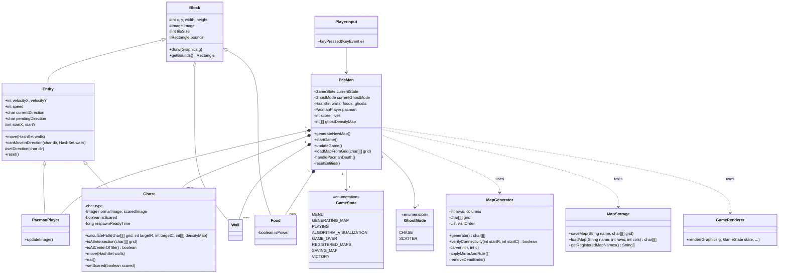

# Pac-Man Java Implementation

A Pac-Man implementation in Java, featuring clever ghost movement, procedural map generation, and custom map persistence.

## Key Features

### Clever Ghost movement

- **Dijkstra Pathfinding**: Ghosts navigate the maze using a weighted Dijkstra algorithm.
- **Ghost Density Map**: To prevent overlapping, ghosts track each other's positions. Tiles occupied by other ghosts incur a weight penalty, encouraging them to spread out.
- **Dual Modes (Chase & Scatter)**: The game features a "Director" logic that flips every 10 seconds between **CHASE** (aggressive pursuit) and **SCATTER** (retreating to home corners).
- **Unique Personalities**:
  - **Blinky (Red)**: Directly targets Pac-Man's current tile.
  - **Pinky (Pink)**: Aims 4 tiles ahead of Pac-Man to cut him off.
  - **Inky (Blue)**: Uses a sophisticated vector logic between Blinky and Pac-Man to trap the player.
  - **Clyde (Yellow)**: Chases until close, then retreats to his corner, creating a "hit-and-run" behavior.

### Smooth Movement & Input

- **Input Buffering**: Implemented input buffering to ensure smooth turns. If you press a direction before reaching an intersection, Pac-Man will automatically turn at the first available opportunity.

### Procedural Map Generation

- **DFS Generation**: Maps are procedurally generated using a Depth-First Search (DFS) algorithm for a sprawling maze feel.
- **Mirror Symmetry**: The algorithm generates the left half and mirrors it to ensure classic arcade aesthetics and perfect balance.
- **Playability Verification**: Every generated map is verified using a Flood Fill (BFS) check to guarantee all areas are reachable.

### Map Management

- **Persistence**: Save and load custom generated maps as `.txt` files.
- **In-Game Registry**: A UI to browse, name, and load your custom creations.

## Class Diagram

## Build & Run

### Prerequisites

- JDK 17 or higher
- Windows (`build.bat`) or Linux/Mac (`build.sh`)

### How to Run

1. Run the build script: `.\build.bat` (Windows) or `./build.sh` (Unix).
2. Use the menu UI or keyboard (1-4) to start playing!

## Technical Details

- **GUI**: Java Swing / AWT
- **Persistence**: `java.nio.file` API
- **Graphics**: Custom `GameRenderer` with layered rendering for gameplay and UI.
